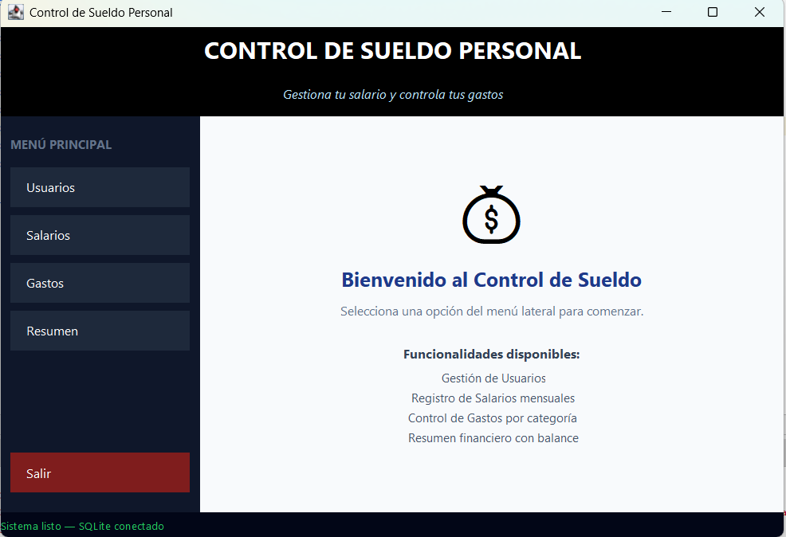

# 💰 Control de Sueldo Personal

## Proyecto del Semestre POO - E192
### Tecnología de Desarrollos de Sistemas Informáticos

📅 **I Semestre 2026**  
👨‍🏫 **Profesor:** Mag. Carlos Adolfo Beltrán Castro  

---

# 👨‍💻 Estudiantes

- **Deniher Alexander Díaz Carvajal** — C.C. 1095927216  
- **Henry Fernando Susa Cruz** — C.C. 1012330071  
- **Liseth Natalia Ayala Acevedo** — C.C. 1098070878  

---

# 🖥 Imagen de Pantalla Inicial con Menú del Proyecto




---

# 🚀 Descripción del Proyecto

**Control de Sueldo Personal** es una aplicación de escritorio desarrollada en **Java SE con Swing** y base de datos **SQLite**.

El sistema permite a los usuarios llevar un control de sus finanzas personales mediante el registro de:

- Salarios mensuales
- Gastos personales
- Categorías de gastos
- Resumen financiero automático

La aplicación calcula el balance disponible según los ingresos y gastos registrados.

---

# 🎯 Objetivo del Proyecto

Desarrollar una aplicación que permita administrar ingresos y gastos personales aplicando conceptos de:

- Programación Orientada a Objetos
- CRUD
- Conexión a Bases de Datos
- Interfaces Gráficas en Java
- Manejo de eventos y formularios

---

# 📂 Funcionalidades del Sistema

## ✅ Gestión de Usuarios
- Registro de usuarios
- Consulta de usuarios
- Actualización de datos
- Eliminación de usuarios

---

## ✅ Gestión de Salarios
- Registro de salario mensual
- Consulta de salario
- Actualización de información

---

## ✅ Gestión de Gastos
- Registro de gastos
- Clasificación por categorías
- Edición de gastos
- Eliminación de registros

---

## ✅ Resumen Financiero
- Total de ingresos
- Total de gastos
- Balance disponible
- Estado financiero general

---

# 🧰 Tecnologías Utilizadas

| Tecnología | Uso |
|---|---|
| Java SE | Desarrollo principal |
| Swing | Interfaces gráficas |
| SQLite | Base de datos |
| JDBC | Conexión a base de datos |
| NetBeans | Entorno de desarrollo |
| GitHub | Control de versiones |

---

# 🗄 Base de Datos

## Nombre de la Base de Datos

```sql
control_sueldo.db
```

---

# 📋 Tablas Principales

## Tabla usuarios

```sql
CREATE TABLE usuarios (
    id INTEGER PRIMARY KEY AUTOINCREMENT,
    nombre TEXT NOT NULL,
    correo TEXT NOT NULL
);
```

---

## Tabla salario

```sql
CREATE TABLE salario (
    id INTEGER PRIMARY KEY AUTOINCREMENT,
    salario_mensual REAL NOT NULL
);
```

---

## Tabla gastos

```sql
CREATE TABLE gastos (
    id INTEGER PRIMARY KEY AUTOINCREMENT,
    descripcion TEXT NOT NULL,
    categoria TEXT NOT NULL,
    monto REAL NOT NULL,
    fecha TEXT NOT NULL
);
```

---

# 📊 Diagrama Entidad Relación

```text
USUARIOS
---------
id
nombre
correo

SALARIO
---------
id
salario_mensual

GASTOS
---------
id
descripcion
categoria
monto
fecha
```

---

# 📁 Estructura del Proyecto

```text
ControlSueldoPersonal/
│
├── src/
│   ├── conexion/
│   ├── modelos/
│   ├── controladores/
│   ├── vistas/
│   └── principal/
│
├── control_sueldo.db
├── README.md
├── base_datos.sql
└── captura_menu.png
```

---

# 🔧 Instalación y Ejecución

## 1️⃣ Clonar el repositorio

```bash
git clone LINK_DEL_REPOSITORIO
```

---

## 2️⃣ Abrir en NetBeans

- Abrir NetBeans
- Seleccionar:
  - File → Open Project
- Abrir la carpeta del proyecto

---

## 3️⃣ Agregar Librería SQLite JDBC

Descargar:

https://github.com/xerial/sqlite-jdbc/releases

Agregar el archivo `.jar` al proyecto:

- Click derecho proyecto
- Properties
- Libraries
- Add JAR/Folder

---

## 4️⃣ Ejecutar el Proyecto

Ejecutar la clase principal:

```java
Main.java
```

---

# 📌 Características Destacadas

✅ CRUD completo conectado a SQLite  
✅ Interfaz gráfica moderna en Swing  
✅ Menú lateral interactivo  
✅ Resumen financiero automático  
✅ Organización modular del proyecto  
✅ Persistencia de datos local  

---

# 📸 Capturas del Sistema

## 🏠 Menú Principal


---

# 📚 Aprendizajes Obtenidos

Durante el desarrollo del proyecto se aplicaron conocimientos sobre:

- Programación Orientada a Objetos
- Bases de Datos SQLite
- JDBC
- Interfaces gráficas
- CRUD
- Organización de proyectos Java

---

# ✅ Estado del Proyecto

✔ Proyecto Finalizado  
✔ Base de Datos Funcional  
✔ CRUD Operativo  
✔ Interfaz Implementada  

---

# 📄 Licencia

Proyecto académico desarrollado para fines educativos.
